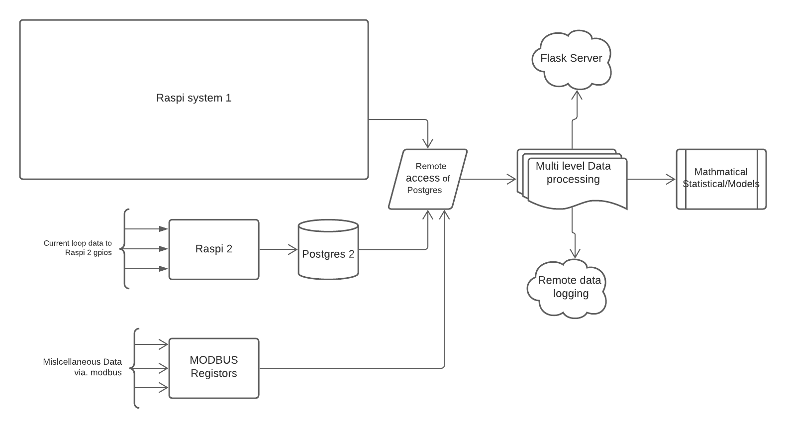
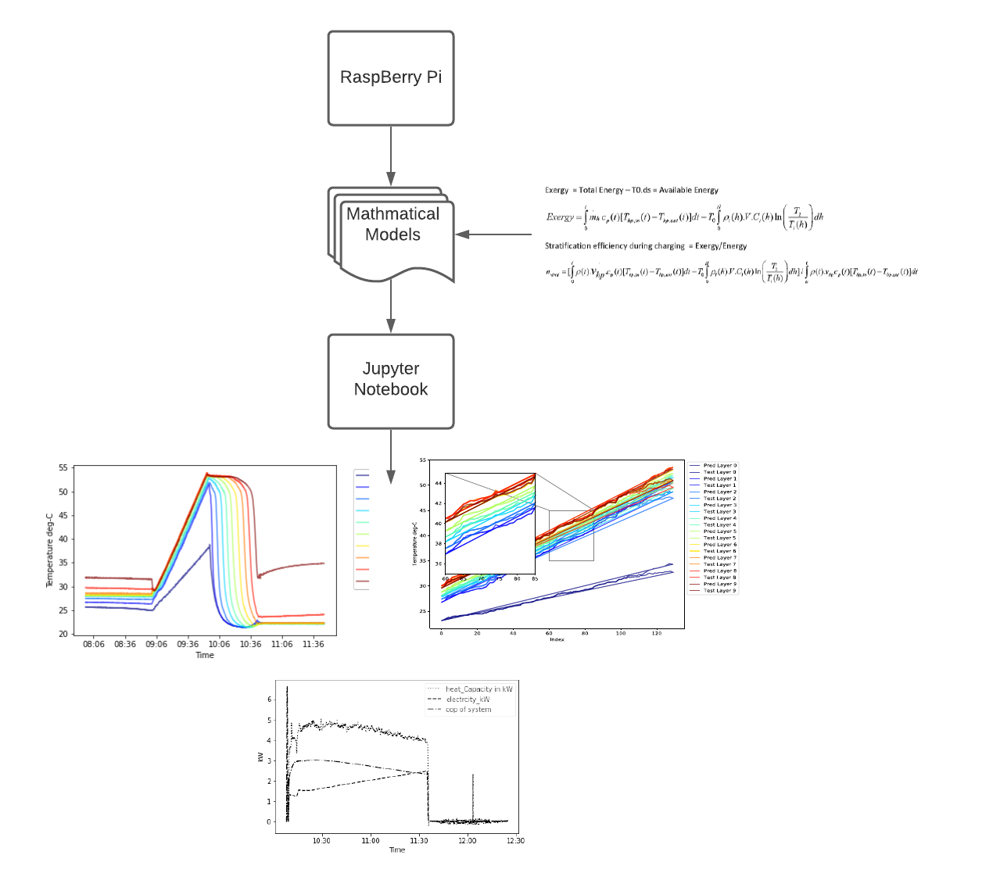

### This is the main server of whole process
* This is Raspberry Pi 2
* It directly loggs in data and saves it in local postgreSQL server from external current loop devices, in addition to communication via. modbus communication
* Modbus is a data communications protocol originally published by Modicon (now Schneider Electric) in 1979 for use with its programmable logic controllers (PLCs). Modbus has become a de facto standard communication protocol and is now a commonly available means of connecting industrial electronic devices.
* This raspberryPi loggs data from WattMeter which stores data in its modbus registers. Hence, this Raspi server communicates with this.
* This RaspberryPi also remotely accesses, raspberryPi 1s data and store it in local tables. 
* After intelligently collecting all teh data - fron RaspberryPi 1, from external current loop devices and from modbus, it logs the data remore servers via. mqtt   protocols
* This server also performs all the necessary data cleaning/crunching/parsing using Numpy/Pandas/SciKit-learn stacks.
* Data is fed to the mathmatical models, developed before hand, optimise the system in terms of Energy.
* This Raspi also performs statistical optimisation/Regression models too.
* This raspberry also makes sure the data collected is of some credibile value, it skips intelligently any data which is otherwise.

*This is the block diagram of the data flow:*

*This is the finished product of the Raspi2*

*This is how physical layer looks like, lousy though:)*

